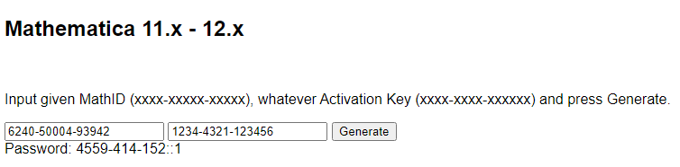

# Mathematica Notes

This repo stores most of my Wolfam Mathematica 11.3 Notebooks.

## Activate Mathematica

1. Launch Mathematica 11.3 for the first time.

2. Click on *Other ways to activate*

3. The window will show your machine's MathID, which is a unique key generated per PC. For instance, `6240-50004-93942`.

4. Enter to an Activation Key and Password generator, for example: https://keybase.theophile.me/info/keygen/mathematica/

5. Insert your MathID and any Activation Key, for instance, `1234-4321-123456` and click on *Generate*.

